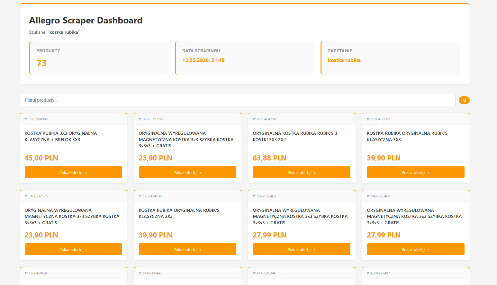

# Allegro Scraper Dashboard



TypeScript web scraper dla Allegro.pl z serwerowym dashboardem. Używa Playwright do scrapowania i Express + EJS do wyświetlania wyników.

## Wymagania

- Node.js >= 18
- npm

## Instalacja

```bash
npm install
npx playwright install chromium
```

## Użycie

### 1. Scrapowanie danych

```bash
npx ts-node scraper.ts -q "kostka rubika"
```

#### Pierwsze uruchomienie (logowanie)

1. Otworzy się przeglądarka Chromium z Allegro
2. Zaloguj się ręcznie (CAPTCHA, 2FA itp.)
3. W terminalu wciśnij Enter
4. Cookies zostaną zapisane do `cookies.json`, scrapowanie ruszy automatycznie

#### Kolejne uruchomienia

Jeśli `cookies.json` istnieje, logowanie jest pomijane.

### 2. Uruchomienie dashboardu

```bash
npm run server
```

Otwórz `http://localhost:3000/` — dashboard wyrenderowany po stronie serwera (SSR) z auto-odświeżaniem co 5 sekund.

### Opcje scrapowania

| Flaga | Opis | Domyślnie |
|-------|------|-----------|
| `-q, --query` | Fraza wyszukiwania | `kostka rubika` |
| `-p, --pages` | Liczba stron do scrapowania | `1` |

## API

| Endpoint | Zwraca |
|----------|--------|
| `GET /api/results` | JSON z danymi produktów |

## Architektura

```
.
├── scraper.ts            skrypt scrapujący (Playwright)
├── server.ts             serwer Express z SSR (EJS)
├── views/dashboard.ejs   szablon dashboardu
├── screen1.png           zrzut ekranu dashboardu
├── wyniki.json           dane ze scrapowania (auto-generated)
├── cookies.json          zapisane sesje (auto-generated)
├── package.json
└── tsconfig.json
```

Scraper parsuje dane z osadzonego JSON (`__listing_StoreState`) na stronie Allegro, a serwer renderuje dashboard po stronie serwera z możliwością filtrowania produktów.
